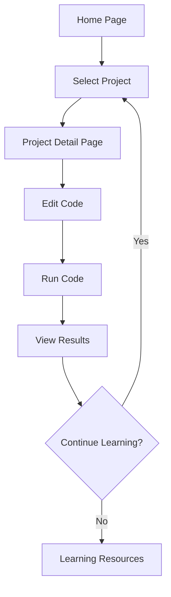

## 1. Product Overview
Pandas数据分析实战项目平台，提供从入门到进阶的10个精选项目，完全在浏览器中运行代码。
- 帮助用户从零开始掌握数据分析核心技能，无需本地环境配置
- 目标用户为数据科学初学者、学生和职场人士，提供实用的数据分析技能培训

## 2. Core Features

### 2.1 User Roles
| Role | Registration Method | Core Permissions |
|------|---------------------|------------------|
| Guest User | No registration required | Access all project examples, run code in browser |

### 2.2 Feature Module
1. **Home page**: project list, navigation, introduction
2. **Project detail page**: code editor, execution environment, result visualization
3. **Learning resources page**: documentation, tips, best practices

### 2.3 Page Details
| Page Name | Module Name | Feature description |
|-----------|-------------|---------------------|
| Home page | Project list | Display 10 pandas projects from beginner to advanced, with difficulty levels and brief descriptions |
| Home page | Navigation | Easy access to different project categories and learning resources |
| Project detail page | Code editor | Interactive code editor with syntax highlighting and auto-completion |
| Project detail page | Execution environment | Run pandas code directly in browser with real-time results |
| Project detail page | Result visualization | Display charts and data tables for analysis results |
| Learning resources page | Documentation | Comprehensive guides on pandas functions and data analysis techniques |
| Learning resources page | Tips and best practices | Practical advice for efficient data analysis workflows |

## 3. Core Process
1. User visits the home page and browses available pandas projects
2. User selects a project based on difficulty level and interest
3. User reads the project description and requirements
4. User modifies and runs the code in the browser-based editor
5. User analyzes the results and learns from the implementation
6. User can navigate to other projects or learning resources

## 4. User Interface Design
### 4.1 Design Style
- Primary colors: #3498db (blue), #2ecc71 (green)
- Secondary colors: #f39c12 (orange), #e74c3c (red)
- Button style: rounded corners, subtle hover effects
- Font: Inter for body text, Montserrat for headings
- Layout style: card-based with clean spacing
- Icon style: minimal, line-based icons for better readability

### 4.2 Page Design Overview
| Page Name | Module Name | UI Elements |
|-----------|-------------|-------------|
| Home page | Hero section | Large header with pandas logo, brief introduction, and call-to-action button |
| Home page | Project list | Grid of project cards with difficulty badges, titles, and short descriptions |
| Project detail page | Code editor | Dark-themed code editor with line numbers, syntax highlighting, and run button |
| Project detail page | Results area | Light-themed results display with data tables and interactive charts |
| Learning resources page | Content sections | Well-organized sections with headings, code snippets, and visual aids |

### 4.3 Responsiveness
- Desktop-first design with mobile adaptation
- Responsive layout that adjusts to different screen sizes
- Touch-friendly interface for mobile users
- Collapsible navigation on smaller screens

### 4.4 3D Scene Guidance
Not applicable for this project