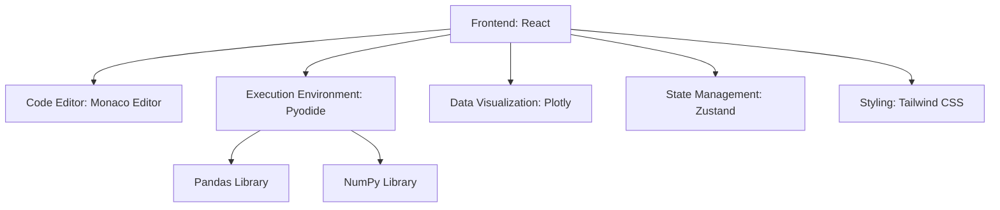

## 1. Architecture Design


## 2. Technology Description
- Frontend: React@18 + tailwindcss@3 + vite
- Initialization Tool: vite-init
- Backend: None (all execution in browser)
- Database: None (in-memory data storage)
- Key Libraries:
  - Pyodide: Python runtime in browser
  - Monaco Editor: Code editor with syntax highlighting
  - Plotly: Interactive data visualization
  - Pandas: Data analysis library
  - NumPy: Mathematical operations library

## 3. Route Definitions
| Route | Purpose |
|-------|---------|
| / | Home page with project list |
| /project/:id | Project detail page with code editor |
| /resources | Learning resources page |

## 4. API Definitions
Not applicable as this is a frontend-only application with in-browser execution.

## 5. Server Architecture Diagram
Not applicable as this is a frontend-only application.

## 6. Data Model
### 6.1 Data Model Definition
Not applicable as this is a frontend-only application with in-memory data.

### 6.2 Data Definition Language
Not applicable as this is a frontend-only application.

## 7. Project Structure
```
/src
  /components
    /ProjectCard
    /CodeEditor
    /ResultDisplay
    /Navigation
  /pages
    /Home
    /ProjectDetail
    /Resources
  /data
    /projects.js (project definitions)
    /sample_data (sample datasets)
  /utils
    /pyodide.js (Pyodide initialization)
    /execution.js (code execution logic)
  /styles
    /globals.css
```

## 8. Core Implementation Details
### 8.1 Pyodide Integration
- Initialize Pyodide with pandas and numpy packages
- Handle code execution in a web worker to avoid UI blocking
- Manage memory usage and clean up resources

### 8.2 Code Editor
- Monaco Editor for syntax highlighting and auto-completion
- Code snippets for common pandas operations
- Error highlighting and line numbers

### 8.3 Result Visualization
- Plotly for interactive charts
- Data table display for tabular data
- Support for different chart types (line, bar, scatter, etc.)

### 8.4 Project Management
- 10 projects organized by difficulty level
- Each project includes:
  - Description and learning objectives
  - Sample code
  - Sample data
  - Expected results
  - Explanations of key concepts

## 9. Performance Considerations
- Lazy loading of Pyodide and large libraries
- Code splitting for better initial load time
- Web worker for code execution to maintain UI responsiveness
- Caching of executed code and results

## 10. Security Considerations
- Sandboxed execution environment for Python code
- No access to local file system or network resources
- Input validation for user code
- Memory usage limits to prevent browser crashes