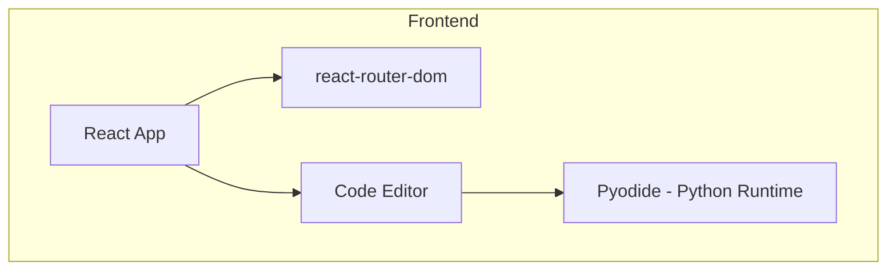

## 1. Architecture Design
纯前端应用架构，使用React构建单页面应用，所有代码在浏览器端运行。



## 2. Technology Description
- Frontend: React@18 + TypeScript + tailwindcss@3 + vite
- Initialization Tool: vite-init
- Browser Python Runtime: Pyodide (用于在浏览器中运行pandas代码)
- Code Editor: Monaco Editor (代码编辑体验)
- Icons: lucide-react

## 3. Route Definitions
| Route | Purpose |
|-------|---------|
| / | 首页 - 个人介绍和项目列表 |
| /project/:id | 项目详情页 - 项目说明和代码编辑器 |

## 4. Data Model (项目数据)

### 4.1 项目数据结构
```typescript
interface Project {
  id: number;
  title: string;
  description: string;
  difficulty: 'beginner' | 'intermediate' | 'advanced';
  icon: string;
  objectives: string[];
  code: string;
  explanation: string;
}
```

### 4.2 10个项目数据定义
```typescript
const projects: Project[] = [
  {
    id: 1,
    title: '数据读取与基础操作',
    difficulty: 'beginner',
    // ...
  },
  // ... 9 more projects
];
```

## 5. File Structure
```
/workspace
├── src/
│   ├── components/
│   │   ├── Header.tsx
│   │   ├── ProjectCard.tsx
│   │   └── CodeEditor.tsx
│   ├── pages/
│   │   ├── Home.tsx
│   │   └── ProjectDetail.tsx
│   ├── data/
│   │   └── projects.ts
│   ├── App.tsx
│   └── main.tsx
├── index.html
├── package.json
├── vite.config.ts
├── tailwind.config.js
└── tsconfig.json
```

## 6. Core Implementation Notes
- 使用Pyodide在浏览器中运行Python/pandas代码
- 响应式设计，适配各种屏幕尺寸
- 优雅的动画和过渡效果
- 深色/浅色模式支持
