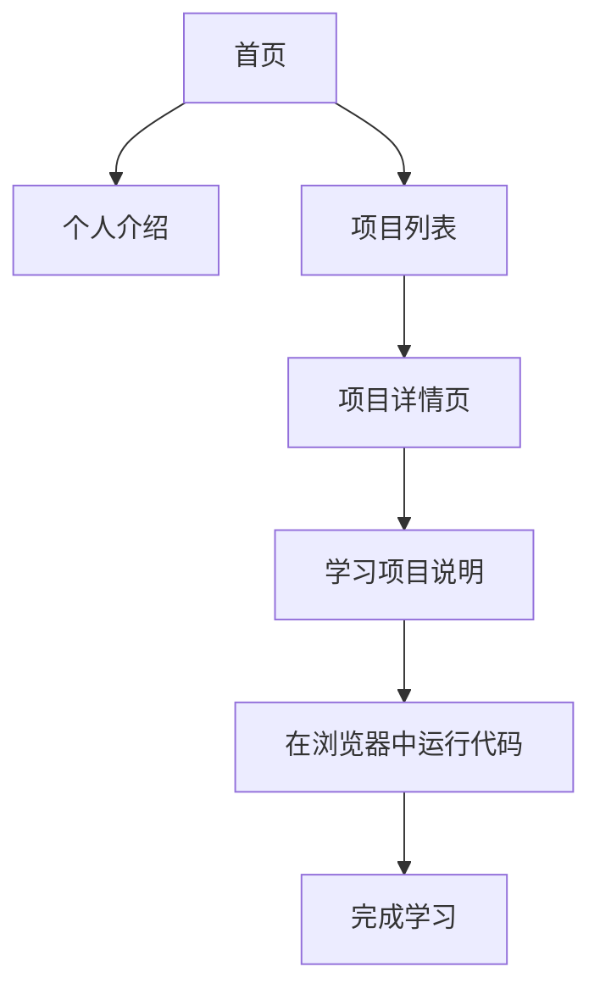

## 1. Product Overview
pandas数据分析训练项目 - 一个包含10个精选实战项目的交互式学习平台，从入门到进阶，让用户从零开始掌握数据分析核心技能，所有代码完全在浏览器中运行。

- 主要用途：提供系统化的pandas数据分析学习路径，通过实战项目帮助用户掌握数据分析技能
- 目标用户：数据分析初学者、Python学习者、想提升数据处理能力的开发者
- 产品价值：系统化学习路径 + 实战项目驱动 + 浏览器端直接运行

## 2. Core Features

### 2.1 User Roles
| Role | Registration Method | Core Permissions |
|------|---------------------|------------------|
| 学习者 | 无需注册 | 浏览所有项目，在浏览器中运行代码 |

### 2.2 Feature Module
1. **首页**：个人介绍、项目概览、导航菜单
2. **项目详情页**：10个从入门到进阶的实战项目
3. **代码编辑器**：内置浏览器端代码运行环境

### 2.3 Page Details
| Page Name | Module Name | Feature description |
|-----------|-------------|---------------------|
| 首页 | 个人介绍 | 展示郭楷纯的个人信息，学校是广东科学技术职业学院 |
| 首页 | 项目导航 | 10个实战项目卡片式展示，从入门到进阶 |
| 项目详情页 | 项目说明 | 项目目标、知识点、数据来源说明 |
| 项目详情页 | 代码编辑器 | 可编辑、运行pandas代码的交互式编辑器 |

## 3. Core Process
用户访问首页 → 查看个人介绍和项目概览 → 选择感兴趣的项目 → 进入项目详情页 → 学习项目说明 → 在代码编辑器中运行和修改代码 → 完成项目学习。

## 4. User Interface Design
### 4.1 Design Style
- 主色调：深蓝色(#1e40af) + 青绿色(#059669)
- 按钮风格：圆角设计，带柔和阴影，悬停有轻微上浮效果
- 字体：Playfair Display(标题) + Noto Sans SC(正文)
- 布局风格：卡片式布局，大留白，视觉层次分明
- 图标风格：简约线性图标，来自lucide-react

### 4.2 Page Design Overview
| Page Name | Module Name | UI Elements |
|-----------|-------------|-------------|
| 首页 | Hero区域 | 渐变背景，个人照片占位，简介文字，动画效果 |
| 首页 | 项目列表 | 卡片网格，难度标签，项目图标，悬停放大效果 |
| 项目详情页 | 顶部导航 | 返回按钮，项目标题，进度指示器 |
| 项目详情页 | 内容区域 | 双栏布局：左侧项目说明，右侧代码编辑器 |

### 4.3 Responsiveness
- Desktop-first设计，适配平板和移动设备
- 触摸优化的交互元素
- 响应式布局自动调整

### 4.4 10个实战项目规划
1. **入门1 - 数据读取与基础操作**：CSV/Excel读取，DataFrame基础
2. **入门2 - 数据清洗**：处理缺失值，重复值，数据类型转换
3. **入门3 - 数据筛选与排序**：布尔索引，条件筛选，排序
4. **进阶1 - 数据聚合与分组**：groupby，聚合函数
5. **进阶2 - 数据合并与连接**：merge，concat，join
6. **进阶3 - 时间序列分析**：日期处理，时间窗口，重采样
7. **进阶4 - 数据可视化基础**：结合matplotlib/seaborn绘图
8. **高级1 - 文本数据处理**：字符串方法，正则表达式
9. **高级2 - 综合案例：电商数据分析**：完整分析流程
10. **高级3 - 综合案例：用户行为分析**：复杂业务场景分析
