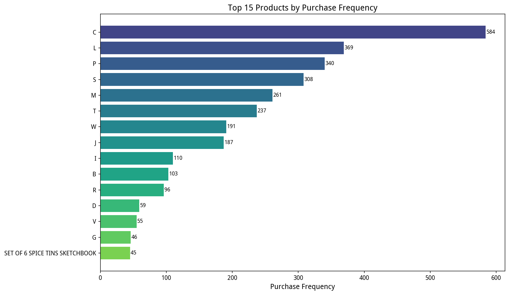
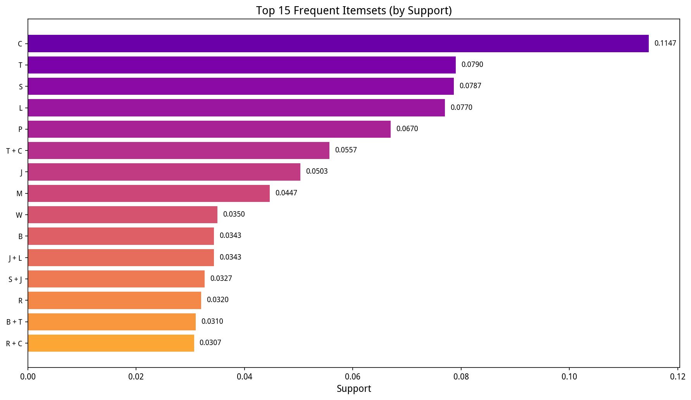
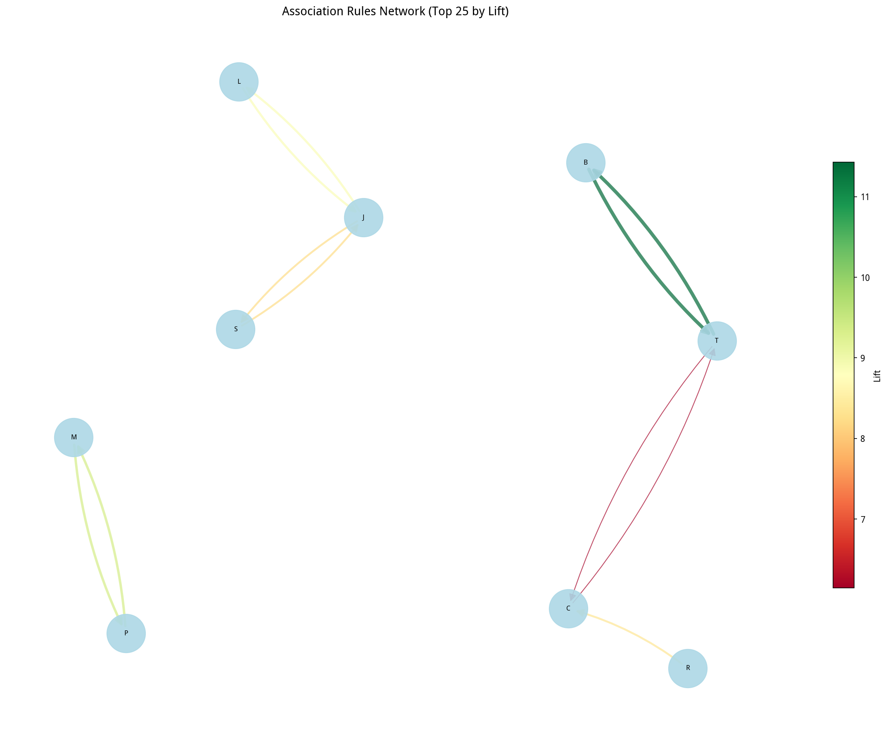
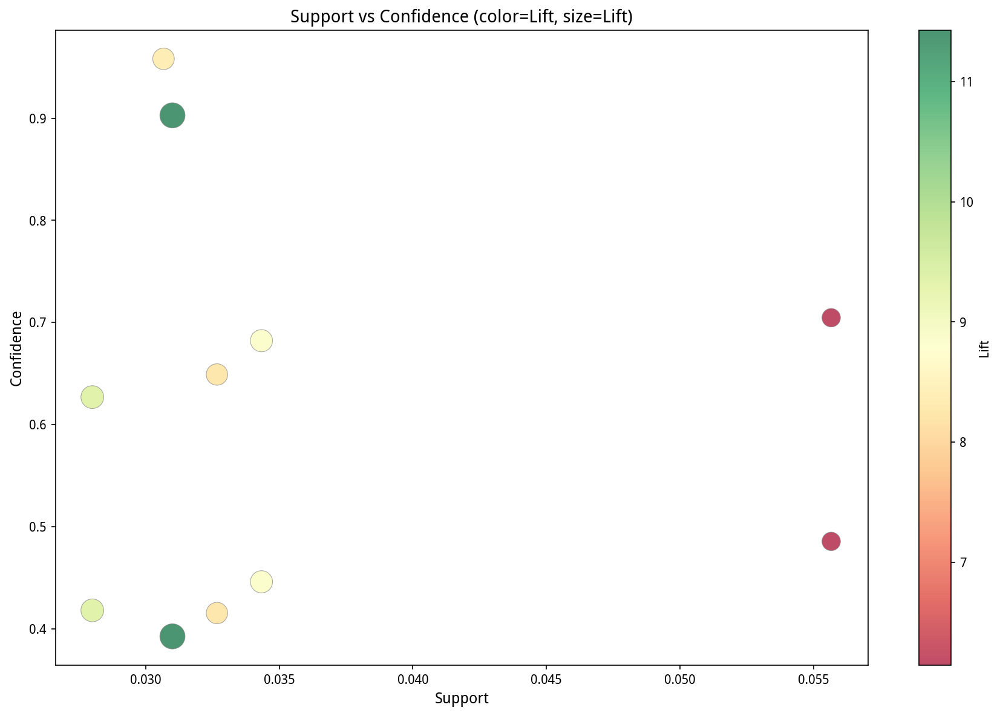
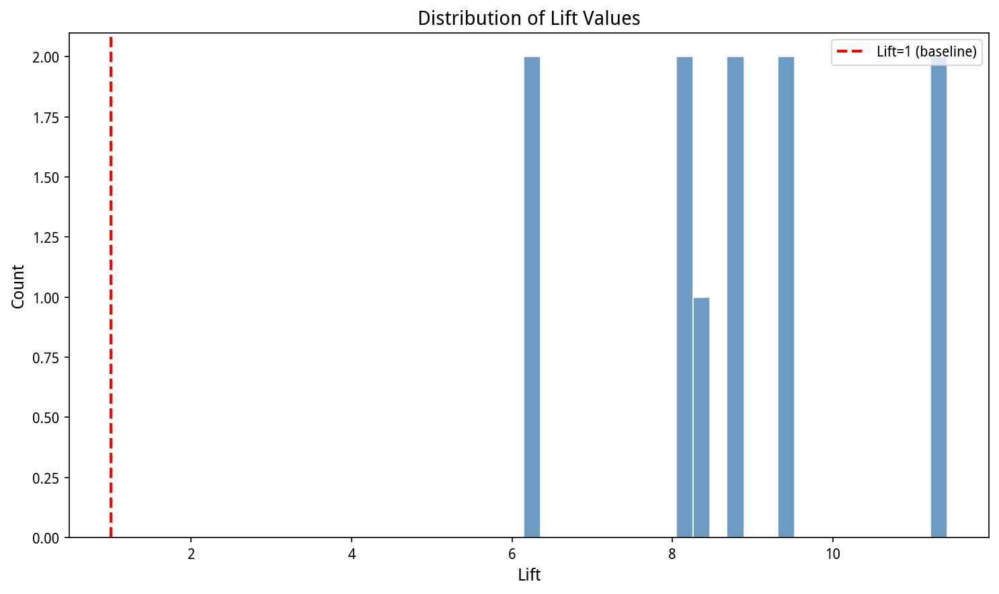
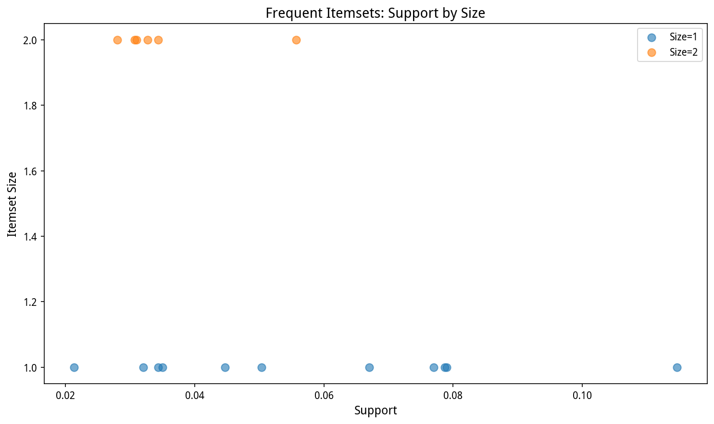

# 购物车关联规则挖掘分析报告

> **分析日期**：2026-05-07  
> **分析工具**：Python (pandas, mlxtend, matplotlib, networkx)  
> **分析方法**：Apriori 关联规则挖掘算法  
> **数据来源**：market_basket.csv

---

## 分析步骤总览

本报告采用**可还原**的设计方式，每个步骤都有明确的输入、处理逻辑和输出，便于复现分析过程。

```
Step 1: 数据加载与质量检查
Step 2: 数据预处理 - 构建事务数据集
Step 3: 关联规则挖掘 - Apriori算法
Step 4: 可视化分析
Step 5: 业务洞察与建议
```

---

## Step 1: 数据加载与质量检查

### 1.1 数据加载

**代码**：
```python
df_raw = pd.read_csv('market_basket.csv')
```

**原始数据信息**：
- 文件路径：`/workspace/.uploads/7dd2585e-26e6-4fbe-970a-593d270cf4da_market_basket.csv`
- 原始记录数：**8,615 行**
- 列名：`['InvoiceNo', 'Description', 'Quantity', 'UnitPrice', 'CustomerID', 'InvoiceDate', 'Country']`

### 1.2 数据样本（前10行）

| InvoiceNo | Description | Quantity | UnitPrice | CustomerID | InvoiceDate | Country |
|-----------|-------------|----------|-----------|------------|-------------|---------|
| 536365 | C | 2 | O | 14008 | 2010-12-04 16:47:17 | United Kingdom |
| 536365 | T | 9 | E | 14008 | 2010-12-04 16:47:17 | United Kingdom |
| 536365 | C | 5 | O | 14008 | 2010-12-04 16:47:17 | United Kingdom |
| 536366 | WHITE METAL LANTERN | 3 | 3.39 | 14001 | 2010-12-24 02:44:34 | Germany |
| 536366 | LUNCH BAG WOODLAND | 6 | 4.95 | 14001 | 2010-12-24 02:44:34 | Germany |
| 536366 | PAPER CLIPS | 7 | 1.95 | 14001 | 2010-12-24 02:44:34 | Germany |
| 536367 | COFFEE MUG DOLLY GIRL | 5 | 2.35 | 13047 | 2010-12-12 21:38:16 | United Kingdom |
| 536367 | CHRISTMAS CRAFT KIT | 3 | 3.95 | 13047 | 2010-12-12 21:38:16 | United Kingdom |
| 536367 | PACK OF 20 SKULL PAPER NAPKINS | 6 | 1.25 | 13047 | 2010-12-12 21:38:16 | United Kingdom |
| 536367 | BOOKSHELF | 11 | 49.95 | 13047 | 2010-12-12 21:38:16 | United Kingdom |

### 1.3 数据质量检查

**缺失值统计**：无缺失值 ✓

**基础统计**：

| 指标 | 数值 |
|------|------|
| 唯一订单数 (InvoiceNo) | 3,000 |
| 唯一商品数 (Description) | 202 |
| 唯一客户数 (CustomerID) | 15 |
| 涉及国家数 (Country) | 13 |

### Step 1 输出摘要

```json
{
  "total_records": 8615,
  "unique_invoices": 3000,
  "unique_products": 202,
  "unique_customers": 15,
  "unique_countries": 13
}
```

---

## Step 2: 数据预处理 - 构建事务数据集

### 2.1 数据清洗

**代码**：
```python
df_clean = df_raw.copy()
df_clean['Description'] = df_clean['Description'].astype(str).str.strip()
df_clean = df_clean[df_clean['Description'] != '']
```

| 步骤 | 记录数 |
|------|--------|
| 原始记录数 | 8,615 |
| 清洗后记录数 | 8,615 |
| 唯一商品数 | 202 |

### 2.2 构建事务数据集

**核心逻辑**：将同一订单（InvoiceNo）下的所有商品聚合为一个事务。

**代码**：
```python
transactions = df_clean.groupby('InvoiceNo')['Description'].apply(list).tolist()
```

**事务统计**：

| 指标 | 数值 |
|------|------|
| 事务总数 | 3,000 |
| 平均每单商品数 | 2.87 |
| 最少商品数 | 1 |
| 最多商品数 | 5 |

### 2.3 商品购买频率 Top 15

| 排名 | 商品 | 购买次数 |
|------|------|----------|
| 1 | C | 584 |
| 2 | L | 369 |
| 3 | P | 340 |
| 4 | S | 308 |
| 5 | M | 261 |
| 6 | T | 237 |
| 7 | W | 191 |
| 8 | J | 187 |
| 9 | I | 110 |
| 10 | B | 103 |
| 11 | R | 96 |
| 12 | D | 59 |
| 13 | V | 55 |
| 14 | G | 46 |
| 15 | SET OF 6 SPICE TINS SKETCHBOOK | 45 |



### 2.4 事务编码 (One-Hot Encoding)

**目的**：将事务列表转换为布尔矩阵，作为Apriori算法的输入。

**代码**：
```python
te = TransactionEncoder()
te_ary = te.fit(transactions).transform(transactions)
df_encoded = pd.DataFrame(te_ary, columns=te.columns_)
```

**编码结果**：
- 矩阵形状：**3,000 行 × 202 列**
- 每行代表一个订单，每列代表一个商品
- 值为 1 表示该商品在该订单中出现

### Step 2 输出摘要

```json
{
  "num_transactions": 3000,
  "num_unique_products": 202,
  "avg_items_per_transaction": 2.87,
  "encoded_matrix_shape": [3000, 202]
}
```

---

## Step 3: 关联规则挖掘 - Apriori算法

### 3.1 挖掘参数设置

| 参数 | 值 | 说明 |
|------|------|------|
| 最小支持度 (min_support) | 0.02 | 项集至少在2%的订单中出现 |
| 最小置信度 (min_confidence) | 0.3 | 规则置信度至少30% |
| 算法 | Apriori | 经典频繁项集挖掘算法 |

### 3.2 频繁项集挖掘

**代码**：
```python
frequent_items = apriori(df_encoded, min_support=0.02, use_colnames=True)
frequent_items['length'] = frequent_items['itemsets'].apply(lambda x: len(x))
```

**结果统计**：
- **频繁项集总数**：17 个
  - 单项频繁集：11 个
  - 双项频繁集：6 个
  - 三项频繁集：0 个

**频繁项集详情**：

| 项集 | 支持度 |
|------|--------|
| [C] | 0.1147 |
| [T] | 0.0790 |
| [S] | 0.0787 |
| [L] | 0.0770 |
| [P] | 0.0670 |
| **[T, C]** | **0.0557** |
| [J] | 0.0503 |
| [M] | 0.0447 |
| [W] | 0.0350 |
| [B] | 0.0343 |
| **[J, L]** | **0.0343** |
| **[S, J]** | **0.0327** |
| [R] | 0.0320 |
| **[B, T]** | **0.0310** |
| **[R, C]** | **0.0307** |
| **[P, M]** | **0.0280** |
| [I] | 0.0213 |

> **加粗**为频繁双项集



### 3.3 生成关联规则

**代码**：
```python
rules = association_rules(frequent_items, metric="confidence", min_threshold=0.3)
rules = rules.sort_values('lift', ascending=False)
```

**结果**：共生成 **11 条关联规则**

### 3.4 关联规则指标统计

| 指标 | 最小值 | 最大值 |
|------|--------|--------|
| 支持度 (Support) | 0.0280 | 0.0557 |
| 置信度 (Confidence) | 0.3924 | 0.9583 |
| 提升度 (Lift) | 6.1451 | 11.4293 |

### 3.5 Top 11 关联规则（按提升度排序）

| 排名 | 前件 → 后件 | 支持度 | 置信度 | 提升度 |
|------|------------|--------|--------|--------|
| 1 | **B → T** | 3.10% | **90.29%** | **11.43** |
| 2 | T → B | 3.10% | 39.24% | **11.43** |
| 3 | **P → M** | 2.80% | 41.79% | **9.36** |
| 4 | M → P | 2.80% | 62.69% | **9.36** |
| 5 | **J → L** | 3.43% | 68.21% | **8.86** |
| 6 | L → J | 3.43% | 44.59% | **8.86** |
| 7 | **R → C** | 3.07% | **95.83%** | **8.36** |
| 8 | S → J | 3.27% | 41.53% | 8.25 |
| 9 | J → S | 3.27% | 64.90% | 8.25 |
| 10 | C → T | 5.57% | 48.55% | 6.15 |
| 11 | T → C | 5.57% | 70.46% | 6.15 |

> **加粗**为核心推荐规则

### 3.6 频繁双项集 Top 6

| 排名 | 项集 | 支持度 |
|------|------|--------|
| 1 | T + C | 5.57% |
| 2 | J + L | 3.43% |
| 3 | S + J | 3.27% |
| 4 | B + T | 3.10% |
| 5 | R + C | 3.07% |
| 6 | P + M | 2.80% |

### Step 3 输出摘要

```json
{
  "algorithm": "Apriori",
  "min_support": 0.02,
  "min_confidence": 0.3,
  "frequent_itemsets_count": 17,
  "rules_count": 11,
  "avg_lift": 8.7669
}
```

---

## Step 4: 可视化分析

### 4.1 关联规则网络图



**解读**：
- 节点代表商品
- 箭头方向：前件 → 后件
- 边颜色代表提升度（绿色越高）
- 边宽度代表提升度强度
- **C-T** 和 **B-T** 形成两个核心关联组

### 4.2 支持度 vs 置信度散点图



**解读**：
- X轴：支持度
- Y轴：置信度
- 颜色和大小：提升度
- 右上角区域（高支持度+高置信度）最具商业价值
- **T→C** 位于最右侧，覆盖面最广

### 4.3 提升度分布



**解读**：
- 所有规则的提升度均远大于 1（基准线）
- 提升度集中在 6~12 之间
- 说明挖掘出的关联规则具有显著的实际意义

### 4.4 项集大小与支持度分布



**解读**：
- 单项集支持度范围较广（2%~11%）
- 双项集支持度集中在 2.8%~5.6%
- 未发现三项及以上频繁集

---

## Step 5: 业务洞察与建议

### 5.1 核心规则解读

#### 🔥 规则1：B → T（提升度 11.43，置信度 90.29%）
- **含义**：购买了商品B的客户，**90.29%** 会同时购买商品T
- **提升度 11.43**：B对T的购买概率有11倍的提升作用
- **业务价值**：极高置信度，是最强绑定组合

#### 🔥 规则7：R → C（提升度 8.36，置信度 95.83%）
- **含义**：购买了商品R的客户，**95.83%** 会同时购买商品C
- **业务价值**：所有规则中置信度最高！R几乎必然与C一起购买

#### 🔥 规则10：T → C（支持度 5.57%，置信度 70.46%）
- **含义**：购买了商品T的客户，**70.46%** 会同时购买商品C
- **业务价值**：支持度最高（5.57%），覆盖面最广，实际影响最大

### 5.2 业务建议

#### 📦 捆绑销售策略

| 推荐组合 | 置信度 | 提升度 | 建议动作 |
|---------|--------|--------|---------|
| **B + T** | 90.29% | 11.43 | 推出B+T组合套餐，给予折扣优惠 |
| **R + C** | 95.83% | 8.36 | R商品页自动推荐C，设置"经常一起购买"标签 |
| **P + M** | 62.69% | 9.36 | 货架相邻摆放，设置联合促销 |

#### 🛒 交叉推荐策略
- **商品J** 是关联枢纽：与L（置信度68.21%）和S（置信度64.90%）均有强关联
  - 在J的商品详情页展示"购买了J的人还购买了L和S"
  - 可将J作为引流商品，带动L和S的销售

#### 📍 货架布局优化
| 区域 | 商品组合 | 理由 |
|------|---------|------|
| 区域1 | C - T - R | C+T是最大组合，R与C强绑定 |
| 区域2 | B - T | B→T置信度90%，最强关联 |
| 区域3 | P - M | 双向强关联 |

#### 🎁 促销活动设计
- **B+T组合券**：利用90.29%的自然购买率，设置"买B享T优惠"
- **R+C组合券**：利用95.83%的高置信度，发放组合优惠券
- **J引流活动**：购买J可享L或S的折扣

---

## 附录：核心指标说明

| 指标 | 公式 | 含义 |
|------|------|------|
| **支持度 (Support)** | P(A∩B) = 同时包含A和B的交易数 / 总交易数 | A和B一起出现的概率 |
| **置信度 (Confidence)** | P(B\|A) = P(A∩B) / P(A) | 购买A后购买B的条件概率 |
| **提升度 (Lift)** | P(B\|A) / P(B) | A对B购买概率的提升倍数，>1为正相关 |

---

## 附录：可还原性说明

本分析可完全还原，步骤如下：

```bash
# 1. 安装依赖
pip install pandas mlxtend matplotlib seaborn networkx

# 2. 运行分析脚本
python market_basket_analysis_v2.py

# 3. 输出文件
# - analysis_data.json (分析数据)
# - chart1-6.png (可视化图表)
```

**完整分析脚本位置**：`/data/user/work/market_basket_analysis_v2.py`

---

*报告生成完成*
